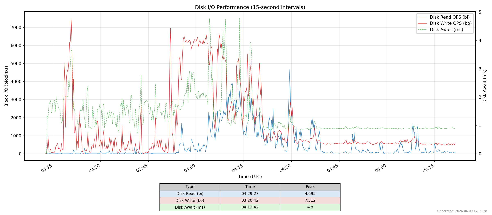

# Disk I/O Performance Graphing for MicroShift CI

Tool for visualizing disk I/O activity from MicroShift CI job runs, primarily
aimed at investigating etcd performance issues.

## Background

MicroShift uses an embedded etcd instance that is highly sensitive to disk I/O
latency. Symptoms such as slow leader elections, "apply request took too long"
warnings, or WAL sync delays often correlate with disk I/O spikes on the CI
node. CI jobs collect [Performance Co-Pilot (PCP)](https://pcp.io/documentation.html)
archives via the `pcp-zeroconf` package throughout the test run, capturing
system-wide performance metrics at high resolution.

This tool processes those PCP archives and produces a time-series graph of
**Disk Read OPS**, **Disk Write OPS**, and **Disk Await** (`disk.dev.await`)
at 15-second intervals, making it straightforward to correlate etcd issues
with underlying disk activity.

**Disk Await** is the average time (in milliseconds) that I/O requests spend
waiting to be serviced by the device, including queue time and actual service
time. It is the single most useful metric for diagnosing etcd I/O problems
because etcd requires low-latency `fdatasync` calls on its WAL and snap files.
When await rises above ~10 ms, etcd heartbeats can be missed and leader
elections may be triggered. The tool reports the **max await across all block
devices** at each sample point so that the worst-case device is always visible.

## Obtaining PCP Data from CI

PCP archives are stored with the CI artifacts under:

```text
artifacts/<test_name>/openshift-microshift-infra-pmlogs/artifacts/<ci_hostname>/
```

Download them using `gsutil`:

```bash
mkdir -p ~/pmlogs && cd ~/pmlogs
python3 -m venv .
./bin/python3 -m pip install gsutil
./bin/gsutil -m cp -r gs://<path> ~/pmlogs/
```

The directory should contain files like `yyyymmdd.hh.mm.{0,index,meta}` and a
`Latest` folio file.

## Prerequisites

- `podman` (used to build and run the analysis container)

No other local dependencies are required. The container image includes PCP
tools, Python 3, and matplotlib.

## Usage

```bash
./run_io_graph.sh [--timezone TZ] [--output-dir DIR] [pcp-data-dir]
```

| Option | Description | Default |
|---|---|---|
| `--timezone TZ` | IANA timezone for timestamps | `UTC` |
| `--output-dir DIR` | Directory for output files | Script directory |
| `pcp-data-dir` | Directory with PCP archive files | Auto-detected |

### Examples

```bash
# Auto-detect PCP data, default timezone (UTC)
./run_io_graph.sh

# Specify data directory and timezone
./run_io_graph.sh --timezone US/Eastern ./path/to/pcp-data

# Custom output directory
./run_io_graph.sh --output-dir /tmp/results --timezone UTC ./path/to/pcp-data
```

## Output

| File | Description |
|---|---|
| `io_data.json` | Extracted data with arrays: `timestamps`, `bi` (reads/s), `bo` (writes/s), `await` (disk await ms) |
| `disk_io_performance.png` | Time-series chart with Read OPS (blue), Write OPS (red), and Disk Await (green, dashed, right Y-axis) |

### Sample Graph



## How to Read the Graph

When investigating etcd performance problems, look for:

- **Disk Await spikes** (green, dashed, right Y-axis) are the primary
  indicator of I/O latency problems. etcd requires `fdatasync` to complete
  within its heartbeat interval (default 100 ms). Await values above ~10 ms
  indicate the disk is under pressure; sustained values above ~50 ms almost
  always correlate with etcd warnings such as "slow fdatasync", "apply request
  took too long", or missed heartbeats leading to leader elections.
- **Write spikes** (red) coinciding with etcd "slow fdatasync" or WAL warnings
  in MicroShift journal logs. Sustained write activity above the baseline
  suggests I/O contention from concurrent workloads or test operations.
- **Read spikes** (blue) during test setup or image pulls that may starve etcd
  of I/O bandwidth.
- **Correlation with timestamps** from etcd log entries. Convert etcd log
  timestamps to the timezone used in the graph to align events.

## Files

| File | Purpose |
|---|---|
| `run_io_graph.sh` | Orchestrator: builds container, runs extraction and plotting |
| `Dockerfile` | Container image with PCP tools, Python 3, and matplotlib |
| `extract_io.sh` | Runs `pcp2json` on PCP archives, extracts all metrics in one pass |
| `parse_pcp.py` | Parses pcp2json output, aggregates per-device instances (sum read/write, max await) |
| `plot_io.py` | Generates the PNG chart from JSON data using matplotlib |
