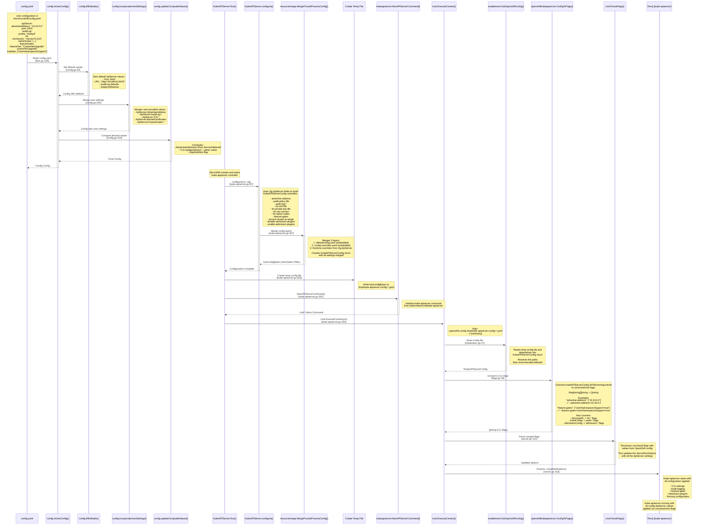

# API Server Config Data Flow

This document traces the data path from the `apiServer` field in `/etc/microshift/config.yaml` down to where the values are ingested by the kube-apiserver.

## UML Sequence Diagram



## Key Data Structures

### 1. MicroShift Config (`pkg/config/apiserver.go`)

```go
type ApiServer struct {
    SubjectAltNames      []string
    AdvertiseAddress     string
    NamedCertificates    []NamedCertificateEntry
    AuditLog             AuditLog
    TLS                  TLSConfig
    FeatureGates         FeatureGates
    URL                  string
    Port                 int
    AdvertiseAddresses   []string
}
```

### 2. KubeAPIServerConfig (`vendor/github.com/openshift/api/kubecontrolplane/v1/types.go`)

```go
type KubeAPIServerConfig struct {
    GenericAPIServerConfig    configv1.GenericAPIServerConfig
    APIServerArguments        map[string]Arguments
    ServiceAccountPublicKeyFiles []string
    ServicesNodePortRange     string
    // ... other fields
}
```

### 3. APIServerArguments (Key-Value Map)

```go
APIServerArguments: map[string]Arguments{
    "advertise-address":      {cfg.ApiServer.AdvertiseAddress},
    "audit-log-maxage":       {strconv.Itoa(cfg.ApiServer.AuditLog.MaxFileAge)},
    "tls-min-version":        {cfg.ApiServer.TLS.MinVersion},
    "tls-cipher-suites":      cfg.ApiServer.TLS.CipherSuites,
    "feature-gates":          {"UserNamespacesSupport=true", ...},
    // ... many more
}
```

## Configuration Flow Steps

### Step 1: Config Loading (`pkg/config/files.go`)

**Function**: `ActiveConfig()`  
**Line**: [120-127](file:///home/microshift/microshift/pkg/config/files.go#L120-L127)

1. Reads `/etc/microshift/config.yaml`
2. Reads YAML files from `/etc/microshift/config.d/*.yaml`
3. Merges all YAML files using JSON patch merge
4. Deserializes into `Config` struct

### Step 2: Config Initialization (`pkg/config/config.go`)

**Function**: `fillDefaults()`  
**Lines**: [92-190](file:///home/microshift/microshift/pkg/config/config.go#L92-L190)

Sets default values for `ApiServer`:
```go
c.ApiServer = ApiServer{
    SubjectAltNames: subjectAltNames,
    URL:             "https://localhost:6443",
    Port:            6443,
}
c.ApiServer.AuditLog = AuditLog{
    MaxFileAge:  0,
    MaxFiles:    10,
    MaxFileSize: 200,
    Profile:     "Default",
}
```

**Function**: `incorporateUserSettings()`  
**Lines**: [195-429](file:///home/microshift/microshift/pkg/config/config.go#L195-L429)

Merges user-provided values:
```go
if u.ApiServer.AdvertiseAddress != "" {
    c.ApiServer.AdvertiseAddress = u.ApiServer.AdvertiseAddress
}
if u.ApiServer.AuditLog.Profile != "" {
    c.ApiServer.AuditLog.Profile = u.ApiServer.AuditLog.Profile
}
// ... TLS settings
// ... FeatureGates
```

**Function**: `updateComputedValues()`  
**Lines**: [434-516](file:///home/microshift/microshift/pkg/config/config.go#L434-L516)

Computes derived values:
- `AdvertiseAddress` (if not set)
- `AdvertiseAddresses` (for dual-stack)
- `TLS.UpdateValues()` - cipher suites normalization

### Step 3: KubeAPIServer Configuration (`pkg/controllers/kube-apiserver.go`)

**Function**: `configure()`  
**Lines**: [97-297](file:///home/microshift/microshift/pkg/controllers/kube-apiserver.go#L97-L297)

Creates `KubeAPIServerConfig` overrides:
```go
overrides := &kubecontrolplanev1.KubeAPIServerConfig{
    APIServerArguments: map[string]Arguments{
        "advertise-address":     {s.advertiseAddress},
        "audit-policy-file":     {...},
        "audit-log-maxage":      {strconv.Itoa(cfg.ApiServer.AuditLog.MaxFileAge)},
        "audit-log-maxbackup":   {strconv.Itoa(cfg.ApiServer.AuditLog.MaxFiles)},
        "audit-log-maxsize":     {strconv.Itoa(cfg.ApiServer.AuditLog.MaxFileSize)},
        "service-cluster-ip-range": {strings.Join(cfg.Network.ServiceNetwork, ",")},
        "disable-admission-plugins": {...},
        "enable-admission-plugins":  {},
        "feature-gates":         {"UserNamespacesSupport=true", ...},
    },
    GenericAPIServerConfig: configv1.GenericAPIServerConfig{
        ServingInfo: configv1.HTTPServingInfo{
            ServingInfo: configv1.ServingInfo{
                MinTLSVersion:     cfg.ApiServer.TLS.MinVersion,
                CipherSuites:      cfg.ApiServer.TLS.CipherSuites,
                NamedCertificates: namedCerts,
            },
        },
    },
}
```

**Function**: `resourcemerge.MergePrunedProcessConfig()`  
**Lines**: [267-291](file:///home/microshift/microshift/pkg/controllers/kube-apiserver.go#L267-L291)

Merges three configuration layers:
1. `defaultconfig.yaml` (embedded baseline)
2. `config-overrides.yaml` (embedded OpenShift defaults)
3. Runtime `overrides` (from cfg.ApiServer)

Result: `kasConfigBytes` - marshaled YAML config

### Step 4: Starting Kube-APIServer (`pkg/controllers/kube-apiserver.go`)

**Function**: `Run()`  
**Lines**: [315-413](file:///home/microshift/microshift/pkg/controllers/kube-apiserver.go#L315-L413)

1. **Line 363-381**: Creates temporary config file
   ```go
   fd, err := os.CreateTemp("", "kube-apiserver-config-*.yaml")
   io.Copy(fd, bytes.NewBuffer(s.kasConfigBytes))
   ```

2. **Line 391-395**: Creates kube-apiserver command
   ```go
   cmd := kubeapiserver.NewAPIServerCommand()
   cmd.SetArgs([]string{
       "--openshift-config", fd.Name(),
       "-v", strconv.Itoa(s.verbosity),
   })
   ```

3. **Line 404**: Executes command
   ```go
   errorChannel <- cmd.ExecuteContext(ctx)
   ```

### Step 5: Kube-APIServer Ingestion (`deps/.../cmd/kube-apiserver/app/server.go`)

**Function**: `RunE` (cobra command handler)  
**Lines**: [96-154](file:///home/microshift/microshift/deps/github.com/openshift/kubernetes/cmd/kube-apiserver/app/server.go#L96-L154)

1. **Line 110**: Read OpenShift config file
   ```go
   openshiftConfig, err := enablement.GetOpenshiftConfig(s.OpenShiftConfig)
   ```

2. **Line 116-119**: Convert to command-line flags
   ```go
   args, err := openshiftkubeapiserver.ConfigToFlags(openshiftConfig)
   // Example: ["--advertise-address=10.43.0.2", "--audit-log-maxage=0", ...]
   ```

3. **Line 122**: Parse flags to update options
   ```go
   cmd.ParseFlags(args)
   ```

4. **Line 153**: Start API server with merged options
   ```go
   return Run(ctx, completedOptions)
   ```

### Step 6: Config to Flags Conversion (`deps/.../openshiftkubeapiserver/flags.go`)

**Function**: `ConfigToFlags()`  
**Lines**: [18-46](file:///home/microshift/microshift/deps/github.com/openshift/kubernetes/openshift-kube-apiserver/openshiftkubeapiserver/flags.go#L18-L46)

Converts `KubeAPIServerConfig` to CLI flags:

```go
func ConfigToFlags(kubeAPIServerConfig *KubeAPIServerConfig) ([]string, error) {
    args := unmaskArgs(kubeAPIServerConfig.APIServerArguments)
    
    // Extract from APIServerArguments map
    // "advertise-address": ["10.43.0.2"] -> --advertise-address=10.43.0.2
    
    // Add additional flags from other config fields
    configflags.SetIfUnset(args, "bind-address", host)
    configflags.SetIfUnset(args, "tls-cipher-suites", 
        kubeAPIServerConfig.ServingInfo.CipherSuites...)
    configflags.SetIfUnset(args, "tls-min-version", 
        kubeAPIServerConfig.ServingInfo.MinTLSVersion)
    
    return configflags.ToFlagSlice(args), nil
}
```

**Function**: `ToFlagSlice()`  
**Lines**: [29-43](file:///home/microshift/microshift/deps/github.com/openshift/kubernetes/vendor/github.com/openshift/apiserver-library-go/pkg/configflags/helpers.go#L29-L43)

Converts map to flag array:
```go
func ToFlagSlice(args map[string][]string) []string {
    var flags []string
    for key, values := range args {
        for _, value := range values {
            flags = append(flags, fmt.Sprintf("--%s=%v", key, value))
        }
    }
    return flags
}
```

### Step 7: OpenShift Config Reading (`deps/.../enablement/intialization.go`)

**Function**: `GetOpenshiftConfig()`  
**Lines**: [27-58](file:///home/microshift/microshift/deps/github.com/openshift/kubernetes/openshift-kube-apiserver/enablement/intialization.go#L27-L58)

1. Reads temp config file
2. Deserializes YAML into `KubeAPIServerConfig`
3. Resolves file paths (relative to config file location)
4. Applies recommended defaults

## Example: Feature Gates Flow

Let's trace the `featureGates` field specifically:

### 1. User Configuration (`/etc/microshift/config.yaml`)
```yaml
apiServer:
  featureGates:
    featureSet: "CustomNoUpgrade"
    customNoUpgrade:
      enabled: ["UserNamespacesSupport"]
      disabled: ["SomeOtherGate"]
```

### 2. Parsed into Config Struct (`pkg/config/apiserver.go`)
```go
ApiServer.FeatureGates = FeatureGates{
    FeatureSet: "CustomNoUpgrade",
    CustomNoUpgrade: CustomNoUpgrade{
        Enabled:  []string{"UserNamespacesSupport"},
        Disabled: []string{"SomeOtherGate"},
    },
}
```

### 3. Current State: Hardcoded Feature Gates (`pkg/controllers/kube-apiserver.go` line 224)

**NOTE**: As of the current implementation, feature gates are hardcoded and the `cfg.ApiServer.FeatureGates` config is not yet used. The implementation would need to add logic to read from `cfg.ApiServer.FeatureGates` and construct the feature-gates argument dynamically.

Current hardcoded implementation:
```go
APIServerArguments: map[string]Arguments{
    "feature-gates": {
        "UserNamespacesSupport=true",
        "UserNamespacesPodSecurityStandards=true",
    },
}
```

**To implement feature gates from config**, the code would need to:
1. Read `cfg.ApiServer.FeatureGates.FeatureSet` to determine the base feature set
2. Parse `cfg.ApiServer.FeatureGates.CustomNoUpgrade.Enabled` and `.Disabled` lists
3. Construct feature gate strings like `"FeatureName=true"` or `"FeatureName=false"`
4. Add them to the `"feature-gates"` argument in the `APIServerArguments` map

### 4. Converted to CLI Flags (`deps/.../flags.go`)
```bash
--feature-gates=UserNamespacesSupport=true
--feature-gates=UserNamespacesPodSecurityStandards=true
```

### 5. Parsed by Kube-APIServer
The kube-apiserver's flag parser reads these flags and enables the feature gates.

## Summary

The data flow is:

1. **YAML file** → `ActiveConfig()` → **Config struct**
2. **Config struct** → `KubeAPIServer.configure()` → **KubeAPIServerConfig struct**
3. **KubeAPIServerConfig** → Marshaled to **temp YAML file**
4. **Temp YAML file** → `GetOpenshiftConfig()` → **KubeAPIServerConfig struct** (in kube-apiserver process)
5. **KubeAPIServerConfig** → `ConfigToFlags()` → **CLI flags array**
6. **CLI flags** → `cmd.ParseFlags()` → **ServerRunOptions** (internal kube-apiserver state)
7. **ServerRunOptions** → Used to configure and start the actual API server

The key transformation points are:
- **Config YAML → Config struct**: Standard YAML unmarshaling
- **Config.ApiServer → KubeAPIServerConfig.APIServerArguments**: Manual mapping in `configure()`
- **KubeAPIServerConfig → CLI flags**: `ConfigToFlags()` conversion
- **CLI flags → Runtime config**: Cobra flag parsing in kube-apiserver

All `apiServer` fields from the MicroShift config eventually become command-line flags that are parsed by the standard Kubernetes kube-apiserver flag parser.

