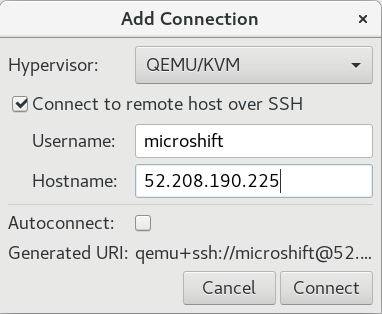

# MicroShift Development Environment in Cloud

## Introduction

The MicroShift development environment should be set up on a **local workstation** as a collection of virtual machines.
* The [development virtual machine](./devenv_setup.md#create-development-virtual-machine) used for compiling and running the MicroShift binaries and building [RHEL for Edge Installer ISO](./rhel4edge_iso.md#build-rhel-for-edge-installer-iso) images
* The [RHEL for Edge virtual machine](./rhel4edge_iso.md#install-microshift-for-edge) used for running MicroShift in a clean, production-like environment
* The [Ansible control node virtual machine](../../ansible/README.md) used for running performance benchmark automation scripts

However, depending on a local workstation hardware configuration and operating system, it may not always be possible to set up the desired development environment, as in the following cases.
* Different hardware platform setup (i.e. `x86_64` local hardware vs `aarch64` development environment or vice versa)
* Lack of hardware resources (e.g. not enough RAM or local storage)

In such cases, it is recommended to use a public cloud for setting up the MicroShift Development environment, as described in the remainder of this document.

## Public Cloud Configuration

The goal is to use public cloud resources for setting up the following configuration.
* The development machine running on a cloud virtual instance
* The RHEL for Edge virtual machine running as a **nested** virtual instance on the development host
* Optionally, the Ansible control node virtual machine running as a **nested**  virtual instance on the development host

This configuration provides for the required functionality and flexibility neccessary for the MicroShift development and testing environments.
> The MicroShift development machine requires at least 8 cores, 16 GB of RAM and 100 GB of disk space.

### AWS Cloud

Start by selecting the right region providing the necessary **metal** instance types for effective support of nested virtualization. Price is the main guiding factor in the choice of a metal instance type because of the modest hardware requirements of the MicroShift development environment.

For MicroShift development and testing in a RHEL for Edge host setup, it is recommended to use the following instances **with** hardware virtualization support:
* For the `x86_64` architecture, one of the [c5 instances](https://aws.amazon.com/ec2/instance-types/c5/) (i.e. `c5n.metal`)
* For the `aarch64` architecture, one of the [c6g instances](https://aws.amazon.com/ec2/instance-types/c6g/) (i.e. `c6g.metal`)

For a MicroShift development-only host setup, it is recommended to use the following instances **without** hardware virtualization support:
* For the `x86_64` architecture, [c5.2xlarge](https://aws.amazon.com/ec2/instance-types/c5/) instance
* For the `aarch64` architecture, [c7g.2xlarge](https://aws.amazon.com/ec2/instance-types/c7g/) instance

> The Europe (Ireland) `eu-west-1` or US East (N. Virginia) `us-east-1` regions are recommended as they usually have the widest selection of hardware options.

Review and configure the following VPC resources.
* A default VPC should be sufficient
* A default subnet in one of the availability zones with access to the Internet

Review and configure the following EC2 resources.
* A default security group with `Inbound rules` set to **only** allow SSH traffic on port 22. It is recommended to further restrict access to the SSH port from your IP address.
* Import your `Key Pair` used for accessing the virtual instances

Proceed by creating a virtual instance using the following parameters.
* Use a descriptive name prefixed by your user name if the account is shared with others (i.e. `myuser-ushift-dev`)
* Select the Red Hat Linux operating system family
* Select the `64-bit (x86)` or `64 bit (Arm)` architecture
* Select Red Hat Enterprise Linux 9 (HVM) operating system.
* Select the instance type depending on your architecture of choice:
    * e.g. `c5.metal` for `x86_64`
    * e.g. `c6g.metal` for `aarch64`
* Select your `Key pair`
* Select your security group, **only allowing** SSH port 22 inbound traffic
* Configure storage with the following volumes:
    * 90 GiB root volume on `gp3` storage type
    * 10 GiB data volume on `gp3` storage type

Review your selections and lauch the cloud instance.
> Unless noted otherwise, all further configuration should be performed on the cloud instance created in this section.

### Other Cloud Environments

Other public cloud vendors and environments should also be suitable for running the MicroShift development environment, provided the appropriate hardware and operating system configuration is available.

## Development Virtual Machine

Log into the cloud instance using the appropriate login credential (i.e. `ec2-user` for AWS) and a private SSH key.

```bash
ssh -i ~/.ssh/<private_key> ec2-user@<instance_public_IP>
```

Create and configure the `microshift` user account, also allowing SSH logins using a password.

```bash
PASSWORD="<strong password>"

sudo useradd -m -s /bin/bash -p "$(openssl passwd -1 ${PASSWORD})" microshift
echo -e 'microshift\tALL=(ALL)\tNOPASSWD: ALL' | sudo tee /etc/sudoers.d/microshift

sudo sed -i 's/PasswordAuthentication.*/PasswordAuthentication yes/g' /etc/ssh/sshd_config
sudo systemctl reload sshd.service
```
> Choose a strong password and make sure you configure the security group to limit inbound connections on the SSH port 22 **only** from your IP address.

Log into the `microshift` user account and run the following commands to create an LVM volume and group on the data volume of the virtual instance. This disk space will be used by the MicroShift TopoLVM operator for storing data.
> Run the `lsblk` command to see the device name of the 10 GiB storage volume allocated during the instance creation.

```bash
DEVICE=/dev/nvme1n1

sudo dnf install -y lvm2
sudo pvcreate      ${DEVICE}
sudo vgcreate rhel ${DEVICE}
```

Finish by running the `scripts/devenv-builder/configure-vm.sh` script to perform the initial configuration as described in the [Configure Virtual Machine](./devenv_setup.md#configuring-vm) document.
> Reboot your host in the end of the configuration procedure to make sure it is running the latest operating system components.

## Nested Virtualization

Nested virtualization allows for a greater flexibility, lesser complexity and reuse of the documented procedures when creating RHEL for Edge images in a public cloud. The performance of such a configuration may be reduced, but it is sufficient for the purpose of testing.

### RHEL for Edge Virtual Machine

Log into the development virtual machine running in the cloud using the `microshift` user account.

Follow the instructions in the [Install MicroShift on RHEL for Edge](./rhel4edge_iso.md) document to create an ISO and install a new virtual machine using **nested** virtualization.

In the [Install MicroShift for Edge](./rhel4edge_iso.md#install-microshift-for-edge) section, use the following commands to install the virtualization prerequisites and bootstrap a virtual machine using the ISO image from the `_output/image-builder` directory.

```bash
VMNAME=microshift-edge
NETNAME=default

./scripts/image-builder/manage-vm.sh config

sudo mv "$(ls -1 "_output/image-builder/microshift-installer-*.$(uname -m).iso")" /var/lib/libvirt/images/ 
sudo -b bash -c " \
cd /var/lib/libvirt/images/ && \
virt-install \
    --name ${VMNAME} \
    --vcpus 2 \
    --memory 3072 \
    --disk path=./${VMNAME}.qcow2,size=20 \
    --network network=${NETNAME},model=virtio \
    --events on_reboot=restart \
    --cdrom ./microshift-installer-*.$(uname -m).iso \
    --noautoconsole \
    --wait \
"
```

### Ansible Control Node Virtual Machine

Log into the development virtual machine running in the cloud using the `microshift` user account.

Run the following command to create a new virtual machine using **nested** virtualization.

```bash
VMNAME=microshift-bench
ISO="/var/lib/libvirt/images/rhel-9.2-$(uname -m)-dvd.iso"

export NCPUS=2
export RAMSIZE=2
export SWAPSIZE=0
export DISKSIZE=10
export DATAVOLSIZE=1

./scripts/image-builder/manage-vm.sh config
./scripts/image-builder/manage-vm.sh create -n "${VMNAME}" -i "${ISO}"
```

> The resources required for the automation host are relatively modest as reflected in the above commands.

### Virtual Machine Management

To manage a virtual machine remotely, it is possible to use `virsh` command line or `Cockpit` Web interface running on the MicroShift development host.

However, it is recommended to use the Virtual Machine Manager application to connect to the host remotely via the `File > Add Connection` menu option.

From the local workstation, copy the SSH key to the `microshift` user account to avoid entering password in `virt-viewer`.
```
VMIPADD=34.243.184.139
ssh-copy-id microshift@${VMIPADDR}
```

From the remote instance, add the `microshift` user to the `libvirt` OS group to allow remote connection.
```
sudo usermod -a -G libvirt $(whoami)
```


