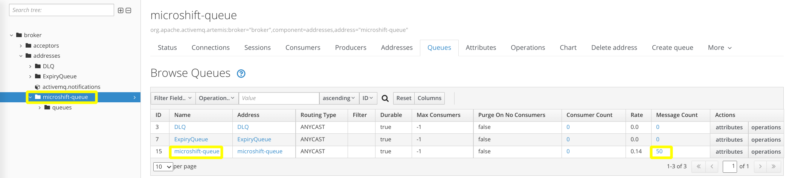

# Deploying AMQ Broker on MicroShift
This document describes a basic workflow for deploying and testing [Red Hat AMQ Broker](https://access.redhat.com/documentation/en-us/red_hat_amq/2020.q4) with MicroShift.

## Create MicroShift Server
Use the instructions in the [Install MicroShift on RHEL for Edge](./rhel4edge_iso.md) document to configure a virtual machine running MicroShift. 

Log into the virtual machine and run the following commands to configure the MicroShift access and check if the PODs are up and running.

```
mkdir ~/.kube
sudo cat /var/lib/microshift/resources/kubeadmin/kubeconfig > ~/.kube/config
oc get pods -A
```

## Install AMQ Broker
Log into the virtual machine and run the following commands to create the AMQ Broker deployment in the `amq-broker` namespace.

```bash
oc apply -f https://raw.githubusercontent.com/openshift/microshift/main/docs/config/amq-broker.yaml
```

Verify that the application started successfully in the `amq-broker` namespace.

```bash
oc get pods -n amq-broker
```

The deployment exposes the AMQ Broker Web Interface and `amqp` protocol ports that can be accessed via the `NodePort` type services. 

Run the following command to see the mapped port numbers.

```bash
oc get service -n amq-broker
NAME      TYPE       CLUSTER-IP      EXTERNAL-IP   PORT(S)          AGE
amq-web   NodePort   10.43.109.135   <none>        8161:31715/TCP   7m5s
amqp      NodePort   10.43.241.87    <none>        5672:30322/TCP   7m4s
```

> In the current deployment, use ports 31715 and 30322 to access Web and `amqp` services respectively. Note that port mapping may be different in other deployments.

## Test AMQ Broker
Log into the hypervisor host to test connection and functionality of the AMQ Broker.

### Producer and Consumer
Run the following commands to login into the Red Hat Container Registry and download the Red Hat AMQ Broker image.

```bash
podman login registry.redhat.io
podman pull registry.redhat.io/amq7/amq-broker:7.8
```

The `artemis` utility from the image can be used to test the AMQ Broker by producing and consuming messages.

```bash
podman run --rm -it amq-broker:7.8 /opt/amq/bin/artemis 
usage: artemis <command> [<args>]

The most commonly used artemis commands are:
    address     Address tools group (create|delete|update|show) (example ./artemis address create)
    browser     It will browse messages on an instance
    check       Check tools group (node|queue) (example ./artemis check node)
    consumer    It will consume messages from an instance
    create      creates a new broker instance
    data        data tools group (print) (example ./artemis data print)
    help        Display help information
    mask        mask a password and print it out
    migrate1x   Migrates the configuration of a 1.x Artemis Broker
    producer    It will send messages to an instance
    queue       Queue tools group (create|delete|update|stat|purge) (example ./artemis queue create)

See 'artemis help <command>' for more information on a specific command.
```

Start by setting the queue name and connection string variables.

```
AMQ_QUEUE=microshift-queue
AMQ_CONNECT="--url tcp://VM_IP:AMPQ_PORT --protocol amqp"
```
> Make sure to use the current virtual machine IP and service port:
> - Replace `VM_IP` with the current IP address of the MicroShift virtual machine (i.e. 192.168.122.32)
> - Replace `AMPQ_PORT` with the current `NodePort` of the `amqp` service (i.e. 30332)

Run the following commands to produce and consume data using the  `microshift-queue` queue. One these operations complete successfully, fifty messages should remain in the queue to be consumed.

```bash
podman run --rm -it amq-broker:7.8 /opt/amq/bin/artemis producer --destination $AMQ_QUEUE $AMQ_CONNECT --message-count 100
podman run --rm -it amq-broker:7.8 /opt/amq/bin/artemis consumer --destination $AMQ_QUEUE $AMQ_CONNECT --message-count  50
```

### Web Interface
Open a browser at the `http://VM_IP:AMQ_WEB_PORT` URL, click on the `Management Console` link and log in using `redhat:redhat` credentials. 
> Make sure to use the current virtual machine IP and service port:
> - Replace `VM_IP` with the current IP address of the MicroShift virtual machine (i.e. 192.168.122.32)
> - Replace `AMPQ_WEB_PORT` with the current `NodePort` of the `amq-web` service (i.e. 31715)

Navigate to `broker > addresses > microshift-queue` in the tree and select the `Queues` tab. Review the `Message Count` column in the table, noting that there are fifty messages remaining to be consumed in the queue.



> See [Producing and consuming test messages](https://access.redhat.com/documentation/en-us/red_hat_amq/2020.q4/html/getting_started_with_amq_broker/creating-standalone-getting-started#producing-consuming-test-messages-getting-started) for more information.

### Data Persistency
The AMQ Broker deployment is configured to mount a 1GB volume at the `/data` directory and set the `AMQ_DATA_DIR` environment variable to point to that location. All the messages sent to the AMQ Broker are persisted on the volume until their expiry or retrieval.

Run the following command to delete the running AMQ Broker pod instance.
```bash
oc delete pods -n amq-broker -l app=amq-broker
```

Wait until a new AMQ Broker pod is started and check the message queue in the `Management Console` as described in the [Web Interface](#web-interface) section. Note that there are still fifty messages remaining to be consumed in the queue.

## Cleanup
Log into the virtual machine and run the following command to delete the AMQ Broker deployment.

```bash
oc delete namespaces amq-broker
```
