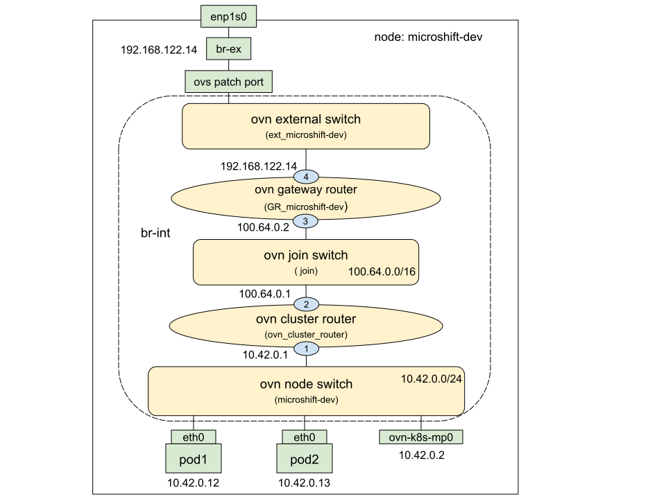

# OVNKubernetes Traffic Flows in MicroShift

## OVN Topology

The following diagram captures the OVN network topology for the MicroShift deployment:



OVN logical components are marked as yellow which provides virtualized network for pods and services.
- ovn external switch: a virtual switch named `ext_<node-name>`
- ovn gateway router: a virtual router named `GR_<node-name>`, aka external gateway router.
- ovn cluster router: a virtual router named `ovn_cluster_router`, aka distributed router
- ovn join switch: a virtual switch named `join`
- ovn node switch: a virtual switch named `<node-name>`

In the above diagram:<br>
- The gateway router is connected to external switch through logical router port `4` named `rtoe-GR_microshift-dev`, attached with node IP `192.168.122.14`.<br>
- The gateway router is connected to join switch through logical router port `3` named `rtoj-GR_microshift-dev`, attached with ovn internal IP `100.64.0.2`.<br>
- The cluster router is connected to join switch through logical router port `2` named `rtoj-ovn_cluster_router`, attached with ovn internal IP `100.64.0.1`.<br>
- The cluster router is connected to node switch through logical router port `1` named `rtos-microshift-dev`, attached with ovn cluster network IP `10.42.0.1`.<br>
- All the pods `pod-1` and `pod-2` are connected to the node switch named after node’s hostname `microshift-dev`.<br>
- The east-west traffic between pods is provided by the node switch `microshift-dev` without NAT.<br>
- The east-west traffic between pod and service is provided by the distributed router `ovn_cluster_router` and node switch `microshift-dev`.<br>
- The north-south traffic between the pod and the external network is provided by the distributed router `ovn_cluster_router` and the host network, connected through the ovn-kubernetes management port `ovn-k8s-mp0`.<br>
- The north-south traffic between service and the external network is provided by the gateway bridge `br-ex` and the external gateway router `GR_microshift-dev`. The join switch `join` connects the external gateway router to the distributed router, then to the pod.<br>

Below is the node/service/pod information used for the traffic flow examples in this doc:

```text
(host)$ oc get nodes -o wide
NAME             STATUS   ROLES                         AGE    VERSION   INTERNAL-IP      EXTERNAL-IP   OS-IMAGE
microshift-dev   Ready    control-plane,master,worker   6d6h   v1.25.0   192.168.122.14   <none>        Red Hat Enterprise Linux 8.6 (Ootpa)

(host)$ oc get pods -A -o wide
NAMESPACE                  NAME                                  READY   STATUS       RESTARTS     AGE    IP               NODE
default                    pod-1                                 1/1     Running      0            3d     10.42.0.12       microshift-dev
default                    pod-2                                 1/1     Running      0            3d     10.42.0.13       microshift-dev
openshift-dns              dns-default-pt2vr                     2/2     Running      0            6d6h   10.42.0.7        microshift-dev
openshift-dns              node-resolver-87kvk                   1/1     Running      0            6d6h   192.168.122.14   microshift-dev
openshift-ingress          router-default-ddc545d88-9bfcb        1/1     Running      0            6d6h   10.42.0.5        microshift-dev
openshift-ovn-kubernetes   ovnkube-master-jlg4f                  4/4     Running      0            6d6h   192.168.122.14   microshift-dev
openshift-ovn-kubernetes   ovnkube-node-jkqrl                    1/1     Running      0            6d6h   192.168.122.14   microshift-dev
openshift-service-ca       service-ca-77fc4cc659-5rzr4           1/1     Running      0            6d6h   10.42.0.4        microshift-dev
[...]

(host)$ oc get svc -A
NAMESPACE           NAME                      TYPE        CLUSTER-IP      EXTERNAL-IP   PORT(S)                   AGE
default             kubernetes                ClusterIP   10.43.0.1       <none>        443/TCP                   6d6h
default             svc-nodeport              NodePort    10.43.19.182    <none>        7000:30700/TCP            30m
openshift-dns       dns-default               ClusterIP   10.43.0.10      <none>        53/UDP,53/TCP,9154/TCP    6d6h
openshift-ingress   router-internal-default   ClusterIP   10.43.179.188   <none>        80/TCP,443/TCP,1936/TCP   6d6h
```

## Pod Network

- All the pods (non hostnetwork) are assigned with an overlay IP address from cluster network subnet (default: 10.42.0.0/16).

### pod to pod

Example: from `pod-1` to `pod-2`.

|step|where                    |srcIP:port  |dstIP:port |comment                                                               |
|:---|:------------------------|:-----------|:----------|:---------------------------------------------------------------------|
|1   |ovn node switch          |10.42.0.12  |10.42.0.13 |source and destination pods are connected to the same ovn node switch |

Step 1, IP and route inside `pod-1`:

```text
(host)$ oc -n default exec -it pod-1 -- bash

(pod-1)$ ifconfig eth0
eth0: flags=4163<UP,BROADCAST,RUNNING,MULTICAST>  mtu 1400
        inet 10.42.0.12  netmask 255.255.255.0  broadcast 10.42.0.255
        inet6 fe80::858:aff:fe2a:c  prefixlen 64  scopeid 0x20<link>
        ether 0a:58:0a:2a:00:0c  txqueuelen 0  (Ethernet)
        RX packets 1141770  bytes 75324455 (71.8 MiB)
        RX errors 0  dropped 0  overruns 0  frame 0
        TX packets 1332745  bytes 57963003473 (53.9 GiB)
        TX errors 0  dropped 0 overruns 0  carrier 0  collisions 0

(pod-1)$ ip route
default via 10.42.0.1 dev eth0
10.42.0.0/24 dev eth0 proto kernel scope link src 10.42.0.12

(pod-1)$ arp
Address                  HWtype  HWaddress           Flags Mask            Iface
10.42.0.13               ether   0a:58:0a:2a:00:0d   C                     eth0
10.42.0.1                ether   0a:58:0a:2a:00:01   C                     eth0
```

### pod to host

What traffic uses this flow?
- pods wish to connect to API server endpoints directly via https
- pods wish to connect to another pod on host network
<br>

Example: from `pod-1` to host `192.168.122.14`.

|step|where                    |srcIP:port   |dstIP:port     |comment                                                                                              |
|:---|:------------------------|:------------|:--------------|:----------------------------------------------------------------------------------------------------|
|1   |ovn node switch          |10.42.0.12   |192.168.122.14 |pod default route to ovn cluster router 10.42.0.1                                                    |
|2   |ovn cluster router       |10.42.0.12   |192.168.122.14 |a static policy sets nexthop to the management port IP 10.42.0.2 and sends the packet to ovn-k8s-mp0 |
|3   |ovn-k8s-mp0              |10.42.0.12   |192.168.122.14 |packet is received by the host                                                                       |

Step 2, static policy in ovn cluster router:

```text
(host)$ oc get pods -n openshift-ovn-kubernetes
NAME                   READY   STATUS    RESTARTS   AGE
ovnkube-master-jlg4f   4/4     Running   0          6d5h
ovnkube-node-jkqrl     1/1     Running   0          6d5h

(host)$ oc -n openshift-ovn-kubernetes exec -it ovnkube-master-jlg4f -c northd -- bash

(northd)$ ovn-nbctl lr-policy-list ovn_cluster_router
Routing Policies
      1004 inport == "rtos-microshift-dev" && ip4.dst == 192.168.122.14 reroute 10.42.0.2
```

**NOTE:** Hereafter, `ovn-nbctl` command is executed inside `northd` container in `ovnkube-master` pod in `ovn-kubernetes` namespace.

Step 3, ovn management port ovn-k8s-mp0 on the host:

```text
(host)$ ifconfig ovn-k8s-mp0
ovn-k8s-mp0: flags=4163<UP,BROADCAST,RUNNING,MULTICAST>  mtu 1400
        inet 10.42.0.2  netmask 255.255.255.0  broadcast 10.42.0.255
        inet6 fe80::743a:81ff:fe5a:5d7  prefixlen 64  scopeid 0x20<link>
        ether 76:3a:81:5a:05:d7  txqueuelen 1000  (Ethernet)
        RX packets 3685586  bytes 870644725 (830.3 MiB)
        RX errors 0  dropped 0  overruns 0  frame 0
        TX packets 3870302  bytes 1363690427 (1.2 GiB)
        TX errors 0  dropped 0 overruns 0  carrier 0  collisions 0

```

### pod to external

What traffic uses this flow?
- package install with dnf/yum inside pod
<br>

Example: from `pod-1` to external `8.8.8.8`.

|step|where                    |srcIP:port      |dstIP:port |comment                                                                                             |
|:---|:------------------------|:---------------|:----------|:---------------------------------------------------------------------------------------------------|
|1   |ovn node switch          |10.42.0.12      |8.8.8.8    |pod default route to ovn cluster router 10.42.0.1                                                   |
|2   |ovn cluster router       |10.42.0.12      |8.8.8.8    |a static route sets nexthop to the management port IP 10.42.0.2 and sends the packet to ovn-k8s-mp0 |
|3   |ovn-k8s-mp0              |10.42.0.12      |8.8.8.8    |packet is received by the host                                                                      |
|4   |host network             |10.42.0.12      |8.8.8.8    |host default route to nexthop and masquerade to uplink (enp1s0) IP                                  |
|5   |enp1s0 (uplink)          |192.168.122.14  |8.8.8.8    |send to external                                                                                    |

Step 2, static route in ovn cluster router:

```text
(northd)$ ovn-nbctl lr-route-list ovn_cluster_router
IPv4 Routes
Route Table <main>:
             10.42.0.0/24                 10.42.0.2 src-ip
```

Step 4, iptable masquerade rule:

```text
(host)$ iptables-save -t nat | grep MASQUERADE
-A POSTROUTING -s 10.42.0.0/24 -j MASQUERADE
```

### host to pod

What traffic uses this flow?
- basis of connecting to router from external or localhost
<br>

Example: from host `192.168.122.14` to `pod-1`.

|step|where               |srcIP:port     |dstIP:port     |comment                                                                                                |
|:---|:-------------------|:--------------|:--------------|:------------------------------------------------------------------------------------------------------|
|1   |ovn-k8s-mp0         |192.168.122.14 |10.42.0.12     |iptable rule SNAT's the source IP to ovn-k8s-mp0's IP 10.42.0.2                                        |
|2   |ovn cluster router  |10.42.0.2      |10.42.0.12     |route to 10.42.0.12                                                                                    |
|3   |ovn node switch     |10.42.0.2      |10.42.0.12     |forward to the dest pod                                                                     |

Step 1, iptable SNAT rule:

```text
(host)$ iptables-save -t nat | grep ovn-k8s-mp0
-A POSTROUTING -o ovn-k8s-mp0 -j OVN-KUBE-SNAT-MGMTPORT
-A OVN-KUBE-SNAT-MGMTPORT -o ovn-k8s-mp0 -m comment --comment "OVN SNAT to Management Port" -j SNAT --to-source 10.42.0.2
```

## Service Network

- All the kubernetes services are assigned with an virtual IP address from cluster service subnet (default: 10.43.0.0/16).
- clusterService refers to kubernetes ClusterIP service with pod backends
- hostService refers to kubernetes ClusterIP service with host backends

### pod to clusterService

What traffic uses this flow?
- pods wish to connect to cluster DNS service
<br>

Example: from `pod-1` to DNS service `10.43.0.10:53`.

|step|where                    |srcIP:port      |dstIP:port     |comment                                                                            |
|:---|:------------------------|:---------------|:--------------|:----------------------------------------------------------------------------------|
|1   |ovn node switch          |10.42.0.12      |10.43.0.10:53  |a loadbalancer rule DNAT’s the service IP 10.43.0.10:53 to endpoint 10.42.0.7:5353 |
|2   |ovn cluster router       |10.42.0.12      |10.42.0.7:5353 |route to 10.42.0.7                                                                 |
|3   |ovn node switch          |10.42.0.12      |10.42.0.7:5353 |forward to the endpoint pod                                             |

Step 1, load balancer in ovn node switch:

```text
(northd)$ ovn-nbctl ls-list
a2a6539a-a8a2-49ba-892a-240b12edcd4c (ext_microshift-dev)
f1ae36d0-dfb7-4a43-b903-7c73e7f3945f (join)
20d9b50e-5c97-4192-9f2c-035fd0d22109 (microshift-dev)

(northd)$ ovn-nbctl ls-lb-list microshift-dev
UUID                                    LB                  PROTO      VIP                   IPs
d6ae342c-cf52-4263-90b8-6cfef665b973    Service_openshif    udp        10.43.0.10:53         10.42.0.7:5353
76c672b3-c4c5-4a94-b6e4-5b6e1e6c38ea    Service_openshif    tcp        10.43.0.10:53         10.42.0.7:5353

(northd)$ ovn-nbctl list load_balancer 76c672b3-c4c5-4a94-b6e4-5b6e1e6c38ea
_uuid               : 76c672b3-c4c5-4a94-b6e4-5b6e1e6c38ea
external_ids        : {"k8s.ovn.org/kind"=Service, "k8s.ovn.org/owner"="openshift-dns/dns-default"}
health_check        : []
ip_port_mappings    : {}
name                : "Service_openshift-dns/dns-default_TCP_node_router+switch_microshift-dev"
options             : {event="false", reject="true", skip_snat="false"}
protocol            : tcp
selection_fields    : []
vips                : {"10.43.0.10:53"="10.42.0.7:5353", "10.43.0.10:9154"="10.42.0.7:9154"}
```

### pod to hostService

What traffic uses this flow?
- pods wish to connect to API server securely via https, e.g service-ca pod
<br>

Example: from `pod-1` to kubernetes APIServer service `10.43.0.1:443`.

|step|where                    |srcIP:port      |dstIP:port          |comment                                                                                 |
|:---|:------------------------|:---------------|:-------------------|:---------------------------------------------------------------------------------------|
|1   |ovn node switch          |10.42.0.12      |10.43.0.1:443       |a loadbalancer rule DNAT’s the service IP 10.43.0.1:443 to endpoint 192.168.122.14:6443 |
|2   |ovn cluster router       |10.42.0.12      |192.168.122.14:6443 |a router policy rule routes the packet to ovn-k8s-mp0 via ovn node switch               |
|3   |ovn node switch          |10.42.0.12      |192.168.122.14:6443 |forward to ovn-k8s-mp0                                                                  |
|4   |ovn-k8s-mp0              |10.42.0.12      |192.168.122.14:6443 |packet is received by the host                                                          |

Step 1, load balancer in ovn node switch:

```text
(northd)$ ovn-nbctl ls-lb-list microshift-dev
UUID                                    LB                  PROTO      VIP                   IPs
458f47e8-1dc3-4f3a-86af-58d485fae135    Service_default/    tcp        10.43.0.1:443         192.168.122.14:6443

(northd)$ ovn-nbctl list load_balancer 458f47e8-1dc3-4f3a-86af-58d485fae135
_uuid               : 458f47e8-1dc3-4f3a-86af-58d485fae135
external_ids        : {"k8s.ovn.org/kind"=Service, "k8s.ovn.org/owner"="default/kubernetes"}
health_check        : []
ip_port_mappings    : {}
name                : "Service_default/kubernetes_TCP_node_switch_microshift-dev"
options             : {event="false", reject="true", skip_snat="false"}
protocol            : tcp
selection_fields    : []
vips                : {"10.43.0.1:443"="192.168.122.14:6443"}
```

Step 2, static policy in ovn cluster router:

```text
(northd)$ ovn-nbctl lr-policy-list ovn_cluster_router
Routing Policies
      1004 inport == "rtos-microshift-dev" && ip4.dst == 192.168.122.14 reroute 10.42.0.2
```

### host to clusterService

What traffic uses this flow?
- basis of NodePort service
<br>

Example: from host `192.168.122.14` to DNS service `10.43.0.10:53`.

|step|where                    |srcIP:port      |dstIP:port     |comment                                                                            |
|:---|:------------------------|:---------------|:--------------|:----------------------------------------------------------------------------------|
|1   |br-ex                    |192.168.122.14  |10.43.0.10:53  |a static openflow rule SNAT's the node IP to 169.254.169.2                         |
|2   |ovn gateway router       |169.254.169.2   |10.43.0.10:53  |a loadbalancer rule DNAT’s the service IP 10.43.0.10:53 to endpoint 10.42.0.7:5353 |
|3   |ovn gateway router       |169.254.169.2   |10.42.0.7:5353 |a router port config SNAT's 169.254.169.2 to 100.64.0.2                            |
|4   |ovn cluster router       |100.64.0.2      |10.42.0.7:5353 |route to 10.42.0.7                                                                 |
|5   |ovn node switch          |100.64.0.2      |10.42.0.7:5353 |forward to the endpoint pod                                                        |

Step 1, static openflow rule in br-ex:

```text
(host)$ ovs-appctl bridge/dump-flows br-ex
duration=538658s, n_packets=125632, n_bytes=11563111, priority=500,ip,in_port=LOCAL,nw_dst=10.43.0.0/16,actions=ct(commit,table=2,zone=64001,nat(src=169.254.169.2))
```

Step 2, load balancer in ovn gateway router:

```text
(northd)$ ovn-nbctl lr-list
9009dd05-e6e6-42d0-85f0-239d78397f89 (GR_microshift-dev)
c531f4a6-170e-4a4a-9d73-4363e3c1e609 (ovn_cluster_router)

(northd)$ ovn-nbctl lr-lb-list GR_microshift-dev
UUID                                    LB                  PROTO      VIP                     IPs
76c672b3-c4c5-4a94-b6e4-5b6e1e6c38ea    Service_openshif    tcp        10.43.0.10:53           10.42.0.7:5353

(northd)$ ovn-nbctl list load_balancer 76c672b3-c4c5-4a94-b6e4-5b6e1e6c38ea
_uuid               : 76c672b3-c4c5-4a94-b6e4-5b6e1e6c38ea
external_ids        : {"k8s.ovn.org/kind"=Service, "k8s.ovn.org/owner"="openshift-dns/dns-default"}
health_check        : []
ip_port_mappings    : {}
name                : "Service_openshift-dns/dns-default_TCP_node_router+switch_microshift-dev"
options             : {event="false", reject="true", skip_snat="false"}
protocol            : tcp
selection_fields    : []
vips                : {"10.43.0.10:53"="10.42.0.7:5353", "10.43.0.10:9154"="10.42.0.7:9154"}
```

Step 3, SNAT to ovn gateway router port IP:

```text
(northd)$ ovn-nbctl get logical_router GR_microshift-dev options
{always_learn_from_arp_request="false", chassis="275588ee-e349-4824-9d80-106bd275228f", dynamic_neigh_routers="true", lb_force_snat_ip=router_ip, snat-ct-zone="0"}

(northd)$ ovn-nbctl show | grep 100.64.0.2 -B2
    port rtoj-GR_microshift-dev
        mac: "0a:58:64:40:00:02"
        networks: ["100.64.0.2/16"]
```

**NOTE:** `rtoj-GR_microshift-dev` is the ovn gateway router port whose IP is 100.64.0.2, it connects ovn gateway router to ovn join switch.

### host to hostService

What traffic uses this flow?
- pods on the host network wish to connect to API server securely via https
<br>

Example: from host `192.168.122.14` to kubernetes APIServer service `10.43.0.1:443`.

|step|where                    |srcIP:port      |dstIP:port          |comment                                                                              |
|:---|:------------------------|:---------------|:-------------------|:------------------------------------------------------------------------------------|
|1   |br-ex                    |192.168.122.14  |10.43.0.1:443       |a static openflow rule SNAT's the node IP to 169.254.169.2                           |
|2   |ovn gateway router       |169.254.169.2   |10.43.0.1:443       |a loadbalancer rule DNAT’s the service IP 10.43.0.1:43 to endpoint 169.254.169.2:6443|
|3   |ovn gateway router       |169.254.169.2   |169.254.169.2:6443  |a static route sets nexthop to the node gateway 192.168.122.1                        |
|4   |ovn gateway router       |169.254.169.2   |169.254.169.2:6443  |a router port rule SNAT’s 169.254.169.2 to the node IP address 192.168.122.14        |
|5   |br-ex                    |192.168.122.14  |169.254.169.2:6443  |a static openflow rule DNAT's the 169.254.169.2 to 192.168.122.14                    |
|6   |br-ex                    |192.168.122.14  |192.168.122.14:6443 |a static openflow rule SNAT's the node IP to 169.254.169.1                           |
|7   |br-ex                    |169.254.169.1   |192.168.122.14:6443 |forward to br-ex                                                                     |

Step 1, static openflow rule in br-ex:

```text
(host)$ ovs-appctl bridge/dump-flows br-ex
duration=538658s, n_packets=125632, n_bytes=11563111, priority=500,ip,in_port=LOCAL,nw_dst=10.43.0.0/16,actions=ct(commit,table=2,zone=64001,nat(src=169.254.169.2))
```

Step 2, load balancer in ovn gateway router:

```text
(northd)$ ovn-nbctl lr-list
9009dd05-e6e6-42d0-85f0-239d78397f89 (GR_microshift-dev)
c531f4a6-170e-4a4a-9d73-4363e3c1e609 (ovn_cluster_router)

(northd)$ ovn-nbctl lr-lb-list GR_microshift-dev
UUID                                    LB                  PROTO      VIP                   IPs
be7decc8-1a90-464a-8d10-10b3752955e4    Service_default/    tcp        10.43.0.1:443         169.254.169.2:6443

(northd)$ ovn-nbctl list load_balancer be7decc8-1a90-464a-8d10-10b3752955e4
_uuid               : be7decc8-1a90-464a-8d10-10b3752955e4
external_ids        : {"k8s.ovn.org/kind"=Service, "k8s.ovn.org/owner"="default/kubernetes"}
health_check        : []
ip_port_mappings    : {}
name                : "Service_default/kubernetes_TCP_node_router_microshift-dev"
options             : {event="false", reject="true", skip_snat="false"}
protocol            : tcp
selection_fields    : []
vips                : {"10.43.0.1:443"="169.254.169.2:6443"}
```

Step 3, static route in ovn gateway router:

```text
(northd)$ ovn-nbctl lr-route-list GR_microshift-dev
IPv4 Routes
Route Table <main>:
                0.0.0.0/0             192.168.122.1 dst-ip rtoe-GR_microshift-dev
```

**NOTE:** `rtoe-GR_microshift-dev` is the another ovn gateway router port whose IP is 192.168.122.14, it connects ovn gateway router to ovn external switch.

Step 4, SNAT to ovn gateway router port IP:

```text
(northd)$ ovn-nbctl get logical_router GR_microshift-dev options
{always_learn_from_arp_request="false", chassis="275588ee-e349-4824-9d80-106bd275228f", dynamic_neigh_routers="true", lb_force_snat_ip=router_ip, snat-ct-zone="0"}

(northd)$ ovn-nbctl show | grep 192.168.122.14 -B2
port rtoe-GR_microshift-dev
        mac: "52:54:00:e2:ed:d0"
        networks: ["192.168.122.14/24"]
```

Step 5, static openflow rule in br-ex:

```text
(host)$ ovs-appctl bridge/dump-flows br-ex
duration=538658s, n_packets=90, n_bytes=12756, priority=500,ip,in_port=2,nw_src=192.168.122.14,nw_dst=169.254.169.2,actions=ct(commit,table=4,zone=64001,nat(dst=192.168.122.14))
```

Step 6, static openflow rule in br-ex:

```text
(host)$ ovs-appctl bridge/dump-flows br-ex
table_id=4, duration=522559s, n_packets=90, n_bytes=12756, ip,actions=ct(commit,table=3,zone=64002,nat(src=169.254.169.1))
```

### pod to nodePortService

What traffic uses this flow?
- none
<br>

Example: from `pod-1` to NodePort service `192.168.122.14:30700`.

|step|where                    |srcIP:port      |dstIP:port          |comment                                                                     |
|:---|:------------------------|:---------------|:-------------------|:---------------------------------------------------------------------------|
|1   |ovn node switch          |10.42.0.12      |192.168.122.14:30700|a loadbalancer rule DNAT’s the 192.168.122.14:30700 to endpoint pod IP:port |
|2   |ovn cluster router       |10.42.0.12      |10.42.0.13:8080     |route to the endpoint pod                                                   |
|3   |ovn node switch          |10.42.0.12      |10.42.0.13:8080     |forward to the endpoint pod                                                 |

Step 1, load balancer in ovn node switch:

```text
(northd)$ ovn-nbctl ls-lb-list microshift-dev
UUID                                    LB                  PROTO      VIP                     IPs
99ca567b-7394-46b8-8b3a-617f54e2fc82    Service_default/    tcp        192.168.122.14:30700    10.42.0.13:8080

(northd)$ ovn-nbctl list load_balancer 99ca567b-7394-46b8-8b3a-617f54e2fc82
_uuid               : 99ca567b-7394-46b8-8b3a-617f54e2fc82
external_ids        : {"k8s.ovn.org/kind"=Service, "k8s.ovn.org/owner"="default/svc-nodeport"}
health_check        : []
ip_port_mappings    : {}
name                : "Service_default/svc-nodeport_TCP_node_router+switch_microshift-dev"
options             : {event="false", reject="true", skip_snat="false"}
protocol            : tcp
selection_fields    : []
vips                : {"192.168.122.14:30700"="10.42.0.13:8080"}

(host)$ oc get svc
NAME           TYPE        CLUSTER-IP     EXTERNAL-IP   PORT(S)          AGE
svc-nodeport   NodePort    10.43.19.182   <none>        7000:30700/TCP   3m51s

(host)$ oc get endpoints
NAME            ENDPOINTS             AGE
svc-nodeport    10.42.0.13:8080       3m52s
```

### external to nodePortService

What traffic uses this flow?
- External traffic wishes to connect to cluster internal service
<br>

Example: from External to NodePort service `192.168.122.14:30700`.

|step|where                    |srcIP:port      |dstIP:port          |comment                                                                |
|:---|:------------------------|:---------------|:-------------------|:----------------------------------------------------------------------|
|1   |host network             |ExternalIP      |192.168.122.14:30700|a static iptable rule DNAT's node port 30700 to cluster IP service:port|
|2   |host network             |ExternalIP      |10.43.19.182:7000   |route to ovn network via br-ex                                         |

Step 1, iptable DNAT rule:

```text
(host)$ iptables-save -t nat | grep OVN-KUBE-NODEPORT
:OVN-KUBE-NODEPORT - [0:0]
-A PREROUTING -j OVN-KUBE-NODEPORT
-A OUTPUT -j OVN-KUBE-NODEPORT
-A OVN-KUBE-NODEPORT -p tcp -m addrtype --dst-type LOCAL -m tcp --dport 30700 -j DNAT --to-destination 10.43.19.182:7000

(host)$ oc get svc
NAME           TYPE        CLUSTER-IP     EXTERNAL-IP   PORT(S)          AGE
svc-nodeport   NodePort    10.43.19.182   <none>        7000:30700/TCP   3m51s
```

Step 2, route in host network:

```text
(host)$ ip route
10.43.0.0/16 via 169.254.169.4 dev br-ex mtu 1400
```

**NOTE:** The rest traffic flow for external to nodePortService is the same as [Host to ClusterServer](#host-to-clusterservice) or [Host to HostService](#host-to-hostservice)
