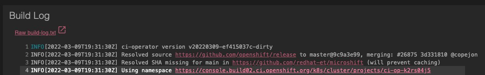
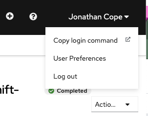

# PoV: MicroShift Contributor
## CI Operations Overview
Openshift CI will conditionally run end-to-end (e2e) testing whenever a PR is opened or updated. Depending on the changes introduced, only unit and validation checks may be run. This is determined per test job according to patterns for the `run_if_changed` key defined for each test (see [here](https://gitHub.com/openshift/release/blob/9c9a3e99c5985eec57464ea137e8db2534df5f1f/ci-operator/config/redhat-et/microshift/redhat-et-microshift-main.yaml#L114)). As a rule of thumb, changes that affect the MicroShift compile-time or runtime (i.e. changes to source code, build scripts, or container image definitions) will trigger e2e test runs.

CI jobs are represented by a GitHub status check on PRs and will report a pending/pass/fail state per job. Jobs are currently loosely broken up by their maintaining OKD/K8S SIG, which is embedded in the status check’s name. Failed jobs will toggle their respective git status as failed and block the PR from merging. Blocks may still be overridden by maintainers. Full list of tests can be found [here](https://github.com/openshift/release/blob/master/ci-operator/config/openshift/microshift/openshift-microshift-main.yaml#L92-L141).

E2e jobs are executed in parallel, each against its own isolated MicroShift cluster. That is, there are as many MicroShift clusters deployed as there are SIG status checks. Expect a complete PR test run to take approximately 45 minutes.

## Running tests manually
Prior to opening a PR it is useful and efficient to be able to run tests locally relying on your own resources. In order to do it you need a running instance of MicroShift and a valid version of [openshift-tests](https://github.com/openshift/origin).
> `openshift-tests` follows the same branching strategy than the rest of the product, so be sure to check base version in `pkg/release/release.go`.

`openshift-tests` requires a kubeconfig and `oc` binary as well. MicroShift generates a kubeconfig located in `/var/lib/microshift/resources/kubeadmin/kubeconfig`, but we will see how to use it depending on local vs remote access to MicroShift instances.

Once we have the kubeconfig working, we can launch the tests. In order to run `openshift-tests` for `MicroShift` we need to provide KUBECONFIG and one specific option:
```
KUBECONFIG=~/.kube/microshift ./openshift-tests --provider none -v 2 <test suite name> -o <output file name> --junit-dir <junit dir path>
```
> `--provider none` avoids having automatic discovery for the cloud provider, which needs non-existing APIs in `MicroShift`.

All `openshift-tests` functionality is available like in a regular OCP cluster. Check [docs](https://github.com/openshift/origin/blob/master/test/extended/README.md) for more information.

### Using local MicroShift
If you execute `openshift-tests` in the same host where `MicroShift` is running there is an already available kubeconfig to do so. This file is located at `/var/lib/microshift/resources/kubeadmin/kubeconfig`.

All that is required is to set kubeconfig to this file and launch the tests.

### Using remote MicroShift
If we have a look at the default kubeconfig we see it tries to connect to localhost, assuming `MicroShift` is running in the same host:
```
apiVersion: v1
clusters:
- cluster:
    certificate-authority-data: ...
    server: https://127.0.0.1:6443
  name: microshift
```
If we look at the certificate for API server to check what the valid names are we see the following:
```
Subject: O = 10.43.0.1 + O = 127.0.0.1 + O = localhost + O = kubernetes + O = kube-apiserver + O = 192.168.122.108 + O = kubernetes.default + O = localhost.localdomain + O = kubernetes.default.svc, CN = kube-apiserver
...
X509v3 Subject Alternative Name: 
  DNS:kube-apiserver, DNS:localhost.localdomain, DNS:kubernetes.default.svc, DNS:kubernetes.default, DNS:kubernetes, DNS:localhost, DNS:192.168.122.108, DNS:127.0.0.1, DNS:10.43.0.1, IP Address:192.168.122.108, IP Address:127.0.0.1, IP Address:10.43.0.1
```

Resolving the hostname DNS entry to a valid IP, or using the raw IPs will work. We can not use any of the `kube-.*` DNS names as those are internal to `MicroShift`, the same happens with `localhost`. For the IP entries, it also happens to `127.0.0.1` and `10.43.0.1`, they are local to `MicroShift` host.

We need to use the external IP (`192.168.122.108` in this example) or the hostname (`localhost.localdomain`). To do this we change the `server` value in kubeconfig and that should be good to go. You can also use `/etc/hosts` to shortcut DNS lookup if you want to use the names.

IP addresses are not guaranteed to be stable in `MicroShift`, but everytime it starts it regenerates kubeconfig so it should be ok during a test run. Remember to open port 6443 if there is a firewall.
```
$ cat ~/.kube/microshift | yq '.clusters[].cluster.server'
https://192.168.122.108:6443
$ KUBECONFIG=~/.kube/microshift oc get pod -A
NAMESPACE                  NAME                                  READY   STATUS    RESTARTS   AGE
openshift-dns              dns-default-dcwx7                     2/2     Running   0          8h
openshift-dns              node-resolver-j2gqf                   1/1     Running   0          8h
openshift-ingress          router-default-6b6bb965d9-v8qzq       1/1     Running   0          8h
openshift-ovn-kubernetes   ovnkube-master-vrcfz                  4/4     Running   0          8h
openshift-ovn-kubernetes   ovnkube-node-kmrcw                    1/1     Running   0          8h
openshift-service-ca       service-ca-5f9bc879d8-qpc2p           1/1     Running   0          8h
openshift-storage          topolvm-controller-5cbd9d9684-kz5m7   4/4     Running   0          8h
openshift-storage          topolvm-node-q6rr9                    4/4     Running   0          8h
```

If you dont want to change kubeconfig you can also use ssh to connect to `MicroShift` host forwarding port 6443 to tunnel all traffic.
```
$ ssh -L 6443:localhost:6443 redhat@192.168.122.108 -fN
$ cat ~/.kube/microshift | yq '.clusters[].cluster.server'
https://127.0.0.1:6443
$ KUBECONFIG=~/.kube/microshift oc get pod -A
NAMESPACE                  NAME                                  READY   STATUS    RESTARTS   AGE
openshift-dns              dns-default-dcwx7                     2/2     Running   0          8h
openshift-dns              node-resolver-j2gqf                   1/1     Running   0          8h
openshift-ingress          router-default-6b6bb965d9-v8qzq       1/1     Running   0          8h
openshift-ovn-kubernetes   ovnkube-master-vrcfz                  4/4     Running   0          8h
openshift-ovn-kubernetes   ovnkube-node-kmrcw                    1/1     Running   0          8h
openshift-service-ca       service-ca-5f9bc879d8-qpc2p           1/1     Running   0          8h
openshift-storage          topolvm-controller-5cbd9d9684-kz5m7   4/4     Running   0          8h
openshift-storage          topolvm-node-q6rr9                    4/4     Running   0          8h
```

## Debugging
> Test runtime objects (namespace, pods, build images) are garbage collected after 1 hour from test completion. The build log remains, but does not provide a holistic view of the job’s life.

Prow/Openshift-CI provide CI bot management via GitHub comments. See [here](https://github.com/kubernetes/test-infra/blob/c341b223083a7e5766be99620eba58cc3c8142f1/prow/jobs.md#triggering-jobs-with-comments) for a complete list. Typically all you need is `/retest` to rerun Prow CI jobs. 

CI related GitHub statuses can be identified by their `ci/prow/*` prefix. When a test fails, the first step should always be to check the status `Details` link.


The `Details` link will bring you to that test’s combined logs for the build, deploy, test, and teardown phases for that e2e job. Most of the time, this log can be invaluable for debugging test errors and exposing regressions. 

Occasionally, deeper investigation is warranted. Errors can be masked in the logs for a variety of reasons, or CI is experiencing some instability (not uncommon) that isn’t immediately obvious in the build log. 

## Debugging CI Cluster Workloads
> Only the PR author is authorized to access a job’s OCP namespace and build artifacts.

OpenShift GitHub org members may gain access to the OCP namespace and backend workloads. To do this, you must first ensure you’ve completed the [OpenShift onboarding checklist for GitHub](https://source.redhat.com/groups/public/atomicopenshift/atomicopenshift_wiki/openshift_onboarding_checklist_for_github).

To access the OCP CI Cluster namespace for a given GitHub status/e2e suite, go to the status Details link and fully expand the build log. Each build log prints a URL to the OCP Console namespace for that CI run, near the very top of the log.



The console will ask you to login with either a `kubeadmin` or company SSO. Select Company SSO. After authenticating, you’ll be presented with the overview page for the OCP project. Expand the left-hand sidebar menu and select `Workloads -> Pods`. 
> You may have to toggle the Developer view to Administrator, located at the top of the sidebar. 

Openshift-CI uses [Prow](https://github.com/kubernetes/test-infra/tree/master/prow#) under the hood to drive CI operations. Without going too into detail, a CI job is divided into a sequence of steps, executed in parallel if possible. Each step is handled by a pod, named for the step’s CI configuration. Logs of the “test” step can always be found in the pod named `e2e-openshift-conformance-sig-[COMPONENT]-openshift-microshift-e2e-run`. Select that pod and examine its logs for the raw test output.

## Examining CI Build Artifacts
When logs aren’t enough to expose a failure’s cause, it may be useful to examine the job’s container artifacts. It is possible to access the CI registry and pull down the job’s images. First, login to the CI cluster by following the steps in [Debugging CI Cluster Workloads]. At the console page, click your name in the upper right corner and select `Copy Login Command`. 
>You may be asked to authenticate again.



Click `Display Token` and copy and execute the `oc login --token=...` command. Then login to the CI registry with `oc registry login`.

CI build imageStreams are named `pipeline:bin`. Pull the image down:
```
podman pull registry.build02.ci.openshift.org/[PROJECT]/pipeline:bin
```

> The `build02` may not be the current build cluster. This may be changed by OpenShift CI maintainers without warning. 

# PoV: MicroShift CI Maintainer
## Historical Data
Access the [Openshift Release Prow Dashboard](https://prow.ci.openshift.org/?repo=redhat-et%2Fmicroshift) for a historical view of job performance. Jobs may be differentiated further using the drop down menus and search fields. To view only PR triggered jobs, select `pre-submit` from the Filter drop down. Select “periodics” to view the nightly history.


## Nightly Updates
Join the `coreos#microshift-alerts` slack channel for reports of nightly e2e jobs. Unlike presubmit (pull-request) jobs, nightly jobs build MicroShift from `main:HEAD`.

Nightly / Periodic Jobs are configured [here](https://github.com/openshift/release/blob/master/ci-operator/config/redhat-et/microshift/redhat-et-microshift-main__periodics.yaml).

## Openshift-CI Concepts
Openshift-CI is a configuration driven automation framework, abstracting Openshift Build API and Prow Job specifications. Users/maintainers define the dependencies, compile time ops, runtime ops, and publishing of images and other build artifacts. All this may be specified in a single config file. However, for reusability, tests can be broken down into atomic (usually non-idempotent) `steps`, which can then be chained together. [Steps](https://docs.ci.openshift.org/docs/architecture/step-registry/) can share certain volumes and environment variables. This portion of the CI is well documented, so this section will focus on MicroShift’s use of the framework and provide links or briefs where relevant.

>File paths must embed the github org, repo, and branch for the managed project. See [here](https://docs.ci.openshift.org/docs/how-tos/onboarding-a-new-component/#prow-configuration).

## [CI Operator Config](https://docs.ci.openshift.org/docs/architecture/ci-operator/)
CI Operator golang API type definitions are specified in the `github.com/openshift/ci-tools` repo, found [here](https://github.com/openshift/ci-tools/blob/67a38022272a48c357879d8abfc4da1ae39827e2/pkg/api/types.go#L34). It’s probably the best authoritative data-field documentation. A CI Operator config API reference is available [here](https://steps.ci.openshift.org/ci-operator-reference#line675).

MicroShift’s top level configuration files are located [here](https://github.com/openshift/release/tree/master/ci-operator/config/openshift/microshift).
* The `openshift-microshift-main.yaml` file provides configuration for pull-request jobs
* The `openshift-microshift-main__periodics.yaml` file specifies periodic jobs  

The files are nearly identical, save for cron configuration. These files are the core configuration for MicroShift’s CI.

## OpenShift End to End (E2E) Conformance Suite

Currently, MicroShift’s CI configuration executes roughly 560 of the over 3000 tests from the `openshift/conformance` test suite. Tests are excluded based on whether they require APIs that are not supported by MicroShift, are skipped by default, or are specific to vendors and cloud providers. The tests are broken up by their Kubernetes Special Interest Group (`sig`) label (e.g. `[sig-api-machinery]`) into suites and all suites are executed in parallel. This means that some suites may execute a hundred or more tests and some run less than 10. The separation is arbitrary, but from a maintainability and debuggability standpoint, it makes sense to divide tests by their targeted functionalities rather than optimize for runtime (subject to change).

## Build Config
Test runtime dependencies can be pulled from static image streams in the CI cluster. These are defined under base_images. For example, the `oc` binary is copied from the `ocp/4.8:cli` image stream, which is aliased to `cli`. Later, fields will refer to this image by that alias.

`Libvirt-installer` is necessary to support out-of-band processes and is maintained [here](https://github.com/openshift/installer/tree/master/images/libvirt). All test images which interact with the GCP instance must be layered on top of the libvirt-installer image. See [Out Of Band Operations](#out-of-band-operations) for more information.


### MicroShifts’s CI Image Aliases

CI Defined Images:
* See [here](https://docs.ci.openshift.org/docs/architecture/ci-operator/#building-artifacts). These images are always created by CI.

Base Images:
* `cli`: provides `oc` binary
* `libvirt-installer`: provides `nss_wrapper`
* `test-bin`: provides `openshift-tests`

Build Root (Image):
* `rhel-8-release-golang-1.16-openshift-4.10`: provides an OpenShift `golang 1.16` base image

Custom Images:
* `linux-amd64-4.8.0-0.microshift`: MicroShift’s in-repo build image
* `microshift-test-binaries`: collection of MicroShift binary and container deployment and test runtime dependencies, based on `libvirt-installer` image
* `microshift-test-rpm`: collection of RPM test runtime dependencies, based on `libvirt-installer` image

## Build Images In Depth
[`build_root`](https://docs.ci.openshift.org/docs/architecture/ci-operator/#build-root-image) specifies the build image base. MicroShift provides its own [build image](https://github.com/openshift/microshift/blob/main/packaging/images/microshift/Dockerfile), which defines its base as that specified by `build_root`, thus CI needs to clone the image stream to the job’s namespace.


[images](https://docs.ci.openshift.org/docs/architecture/ci-operator/#building-container-images) provides for defining custom images, either stored as container files in the source project, or as inline `Dockerfile` literals. The `from` and `to` fields are not quite the inverse of each other. `from` causes the CI to overwrite the `FROM` field of the image before building it. If the value is an image alias, the alias is expanded inplace. `to` defines the `ImageStream` tag of the output image. Note that image names are generated dynamically. This provides a way to define [multi-stage builds](https://docs.ci.openshift.org/docs/architecture/ci-operator/#building-container-images) within the images stanza. For example, image `microshift-test-binaries` sets `from: libvirt-installer`, forcing the CI to build (or copy to the namespace) the images sequentially rather than in parallel.

A second, more precise configuration to invoke multi-stage builds is provided by the `inputs` field. This is analogous to the `COPY --from=$PREVIOUS_IMAGE` directive of multi-stage builds. A key distinction is that the data transfer is not directly between images. Rather, files are copied from `source_path` in the image to the current build’s context on the container host, then copied from build context into the current image. This is why all `destination:` values are `.` and why inline `Dockerfile` references file paths at the root of the build context.

## Test Config
> Golang API type definitions of test’s data structure can be found [here](https://github.com/openshift/ci-tools/blob/67a38022272a48c357879d8abfc4da1ae39827e2/pkg/api/types.go#L608). 

MicroShift’s tests are configured as sequences of `steps`, which are translated by the CI into OpenShift Build and Prow Job specs. A [step](https://docs.ci.openshift.org/docs/architecture/step-registry/#step) defines the container image, dependencies, secret injections, and shell commands to be executed. Multiple step references are encapsulated into larger units called [chains](https://docs.ci.openshift.org/docs/architecture/step-registry/#chain) and [workflows](https://docs.ci.openshift.org/docs/architecture/step-registry/#workflow). The MicroShift CI operator config file specifies a workflow, the cluster profile, and conditionals for each test, under the tests arrays.

Go API type definitions for steps is found [here](https://github.com/openshift/ci-tools/blob/master/pkg/api/types.go), and is probably the most useful source for data field documentation.

**Example:**

```
tests:
- as: e2e-openshift-conformance-sig-api-machinery
  optional: true
  run_if_changed: ^(cmd/.*|pkg/.*|packaging/.*|vendor/.*|go\.sum|go\.mod|Makefile|.*\.sh)
  steps:
    cluster_profile: gcp
    workflow: openshift-microshift-e2e-openshift-conformance-sig-api-machinery
```

* `as: NAME`<br> 
Prow job / pod name. **DO NOT REUSE THE NAME OF A TEST AS A STEP/CHAIN/WORKFLOW NAME**. This will cause CI to silently fail to build all same-named  step containers after the first instance of the name. This is a recurring bug with CI and can be time consuming to debug.
* `optional: true`<br>
Whether the CI should consider the test as merge blocking.
* `run_if_changed: <REGEX>`<br>
Patterns match files or paths that trigger the test if changed
* `steps`<br>
An array of multi-stage test objects, see golang type definitions [here](https://github.com/openshift/ci-tools/blob/67a38022272a48c357879d8abfc4da1ae39827e2/pkg/api/types.go#L666).
    * `cluster_profile`<br>
    Triggers GCP API credential generation and secret injection into all steps.
    * `workflow`<br>
    Name of the workflow, inside the step registry to execute

> It is possible to define step literals in the main config file, but this should only be done for trivial test setups and implies zero reusability. Most MicroShift tests are configured in the step registry.

## Out-of-Band Operations
OpenShift-CI assumes test artifacts are meant to be deployed onto a stock, or modified stock OpenShift cluster as containerized workloads. Since this is not an ideal test environment for MicroShift, we’ve had to adopt some unsupported methods for configuring our own test infra. To do this, MicroShift employs [OpenShift Installer’s libvirt-installer image](https://github.com/openshift/installer) to provide an `nss-wrapper` script. This is required to workaround the way OCP assigns arbitrary user IDs to containers which breaks ssh client operations inside the container.

## Test Step Architecture
For more on Steps and the Step Registry, see [docs](https://docs.ci.openshift.org/docs/architecture/step-registry/).

Steps, chains, and workflows together define an execution tree, where each leaf is a step-ref, and is executed in a depth-first traversal. Test execution falls into 3 phases: pre-test, test, and post-test. A failure at any step will end the test run. The post phase is always executed to ensure no resources are orphaned.

Each suite, as well as some one-off tests, are defined under their own execution tree. For example, `sig-apps`:


> Bear in mind that workflows may specify other workflows, chains, or refs. Chains may specify other chains or refs.

### Phase: Pre
This phase handles 2 key operations: configuring test infrastructure (a GCP instance, network, firewall, etc), and installing the CI build of MicroShift and test dependencies on that instance.

### Phase: Test
Steps here first define a set of OpenShift conformance tests to execute in a file on the GCP instance at `$HOME/suite.txt`. Then the `openshift-microshift-e2e-run` step runs the `openshift-tests` binary, passing in this file.

### Phase: Post
Deprovisions the GCP test infrastructure.

## Secret Injection
This is well [documented](https://docs.ci.openshift.org/docs/how-tos/adding-a-new-secret-to-ci/). Secrets are stored in [Vault](https://vault.ci.openshift.org/ui/vault/auth?with=oidc%2F). Leave `Role` as `default` and click `Sign in with OIDC Provider`. This will ask you to sign in with your Red Hat SSO login. Once a secret is present in Vault, step refs can specify these secrets under the `credentials` field (see [here](https://docs.ci.openshift.org/docs/architecture/step-registry/#injecting-custom-credentials)).


At present MicroShift steps inject the following credentials:
- RHSM subscription (required for installing system and test dependencies on the GCP test instances)
- CI Pull Secret (required to pull images in nightly rebase job)
- GitHub App ID and private key (required to push branches and create Pull Requests with a nightly rebase)

### Obtaining GitHub App's ID and private key for PR creation script
GitHub App can be presented as a set of credentials with specific permissions authorized against a repository. GitHub App can be created using the form at [github.com/settings/apps/new](https://github.com/settings/apps/new).

[Pull Request creation script](../scripts/create_pr.py) requires the following read and write permissions:
- Contents (to push branches directly to the repository)
- Pull requests (to create Pull Requests)

After creating the GitHub App, a private key must be generated and added to the Vault together with GitHub App ID.
Step configuration contains a `credentials` stanza which needs to be configured to supply the credentials from the Vault to the step at runtime.
Credentials are provided to `create_pr.py` with following environmental variables:
- `APP_ID` - ID of the App
- `KEY` - path to the private key
- `REPO` - repository to work against (push branch and create PR)
- `ORG` - repository's organization


## [CI Config Contributions](https://docs.ci.openshift.org/docs/how-tos/contributing-openshift-release/)
Patching processes are well documented. Consider the following as a `tl;dr`.

### Merging
CI is designed to be a self-service infrastructure. Merge privilege is managed via an `OWNERS` file. `Approvers` may use `/lgtm` on PRs to signal merge automation. This file must be present in each directory of a project’s CI files. It is common that a project’s root `OWNERS` is specified, and all child directories soft link it. See [docs](https://docs.ci.openshift.org/docs/how-tos/onboarding-a-new-component/#setting-up-team-ownership-of-ci-operator-and-prow-config-files) for more info.

### Submitting Patches
As stated previously, CI configuration is used to generate Builds and Prow Jobs. For this, CI has included some helpful make targets that must be run prior to pushing changes. The targets cover different areas of configuration, but it is recommended that they be run in aggregation with `make update`.

### Testing Patches
The CI will execute configuration patches as a `rehearsal` job against the `HEAD` commit for the git ref embedded in the config file name (see [here](https://docs.ci.openshift.org/docs/how-tos/onboarding-a-new-component/#bootstrapping-configuration-for-a-new-repository)). The PR submitter and approvers/reviews specified in relevant `OWNERS` files may use `/retest` in the PR’s comment section to rerun tests. More granular bot commands will be commented in the PR by the `openshift-ci-bot`, following test failures.

### CI Points of Contact in Slack
* `coreos#forum-testplatform`<br>
Ping `@dptp-helpdesk` with issues related to CI operation, config debugging help, and other technical issues. The help desk is not generously staffed; non-specific questions will likely get you a link to documentation. Targeted questions with links to troublesome config sections usually generate the most helpful feedback.
* `coreos#announce-testplatform`<br>
Reliable source of info on CI outages and status updates
