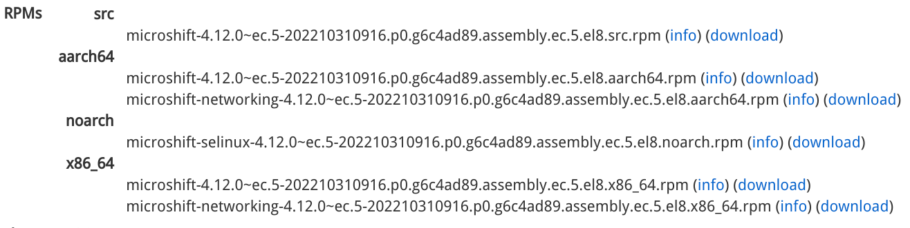

# MicroShift RPM Packages for Development and Testing

> Connect to the Red Hat Virtual Private Network (VPN) for accessing the development packages.

MicroShift RPM development packages are intended to be used internally at Red Hat to facilitate the development and QE processes, **never** to be distributed to customers. 

## Build Cadence
The packages are produced every time a corresponding OpenShift nightly build is successful. For example, MicroShift 4.12.0 RPM packages are built every time the OpenShift [4.12.0-0.nightly](https://openshift-release.apps.ci.l2s4.p1.openshiftapps.com/#4.12.0-0.nightly) job is accepted.

## Package Download
Review the [MicroShift Brew Package](https://brewweb.engineering.redhat.com/brew/packageinfo?packageID=82827) page to see the list of MicroShift RPM package builds.

Select an individual build to see more information including build version, release and links to the RPM info pages and download locations.


...


Given a build version and a release identifier, use the following command to download all the relevant RPM files from the [MicroShift Brew Download](http://download.eng.bos.redhat.com/brewroot/vol/rhel-8/packages/microshift/) site.

```bash
BUILD_VER=4.12.0~ec.5
BUILD_REL=202210310916.p0.g6c4ad89.assembly.ec.5.el8

wget -r -L -nd -np -l4 --accept-regex "$(echo $BUILD_VER | sed "s;\.;\\\.;")" -A "*${BUILD_REL}*.rpm" http://download.eng.bos.redhat.com/brewroot/vol/rhel-8/packages/microshift/
```
