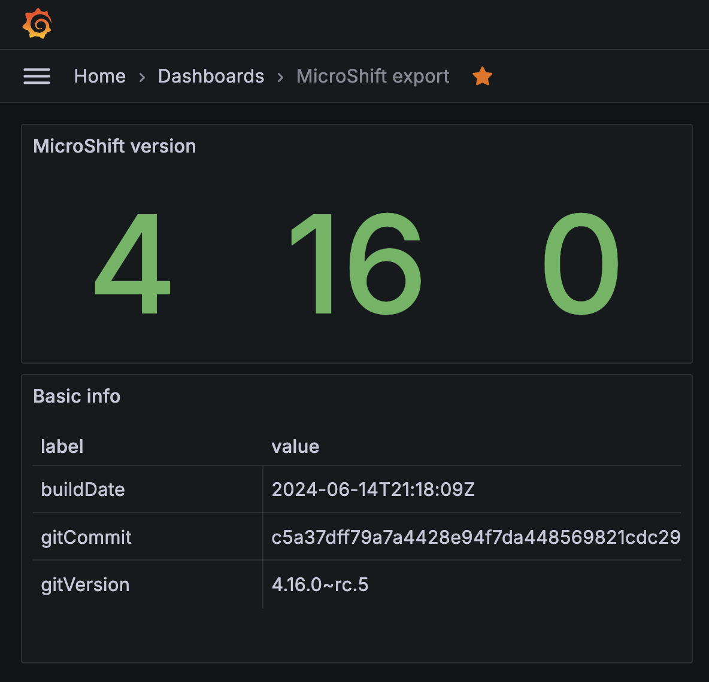

# MicroShift Prometheus exporter

A MicroShift Prometheus exporter to collect unique metrics from a MicroShift cluster

## Prerequisites
 - MicroShift installed and running
 - Go version >= 1.21.11

## Usage
Export metrics: `go run .`

Fetch metrics: `curl -s http://localhost:9090/metrics`:
```
# HELP microshift_info MicroShift info
# TYPE microshift_info gauge
microshift_info{buildDate="2024-06-14T21:18:09Z",gitCommit="c5a37dff79a7a4428e94f7da448569821cdc2970",gitVersion="4.16.0~rc.5"} 1
# HELP microshift_version MicroShift version
# TYPE microshift_version gauge
microshift_version{level="major"} 4
microshift_version{level="minor"} 16
microshift_version{level="patch"} 0
```

## Grafana dashboard
You can try it out [running grafana from a container](https://grafana.com/docs/grafana/latest/setup-grafana/installation/docker/#run-grafana-via-docker-cli) and then [add the dashboard](https://grafana.com/docs/grafana/latest/dashboards/build-dashboards/create-dashboard/#create-a-dashboard) from [the json definition](grafana_dashboard.json):

